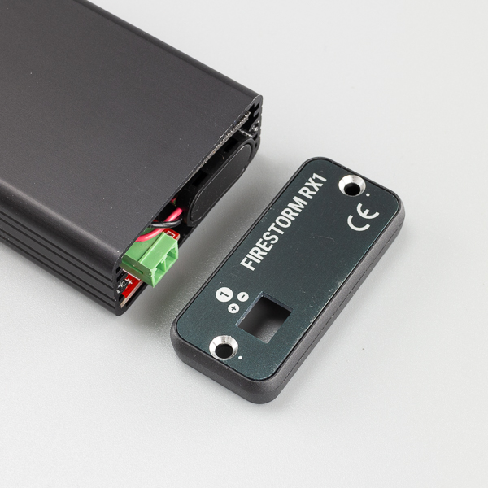
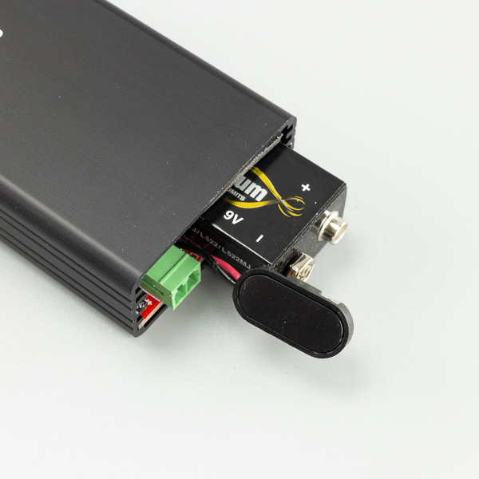
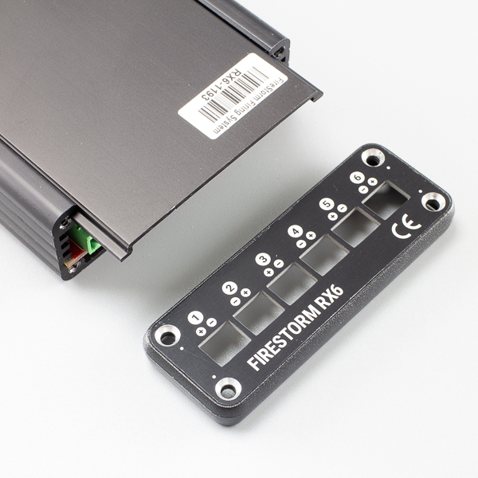
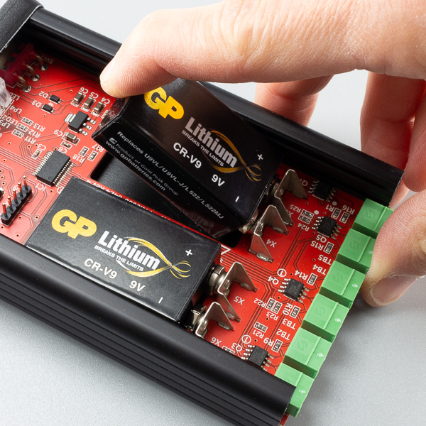
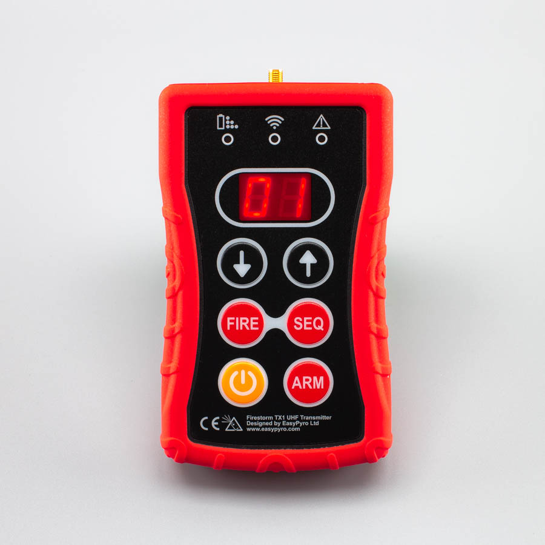
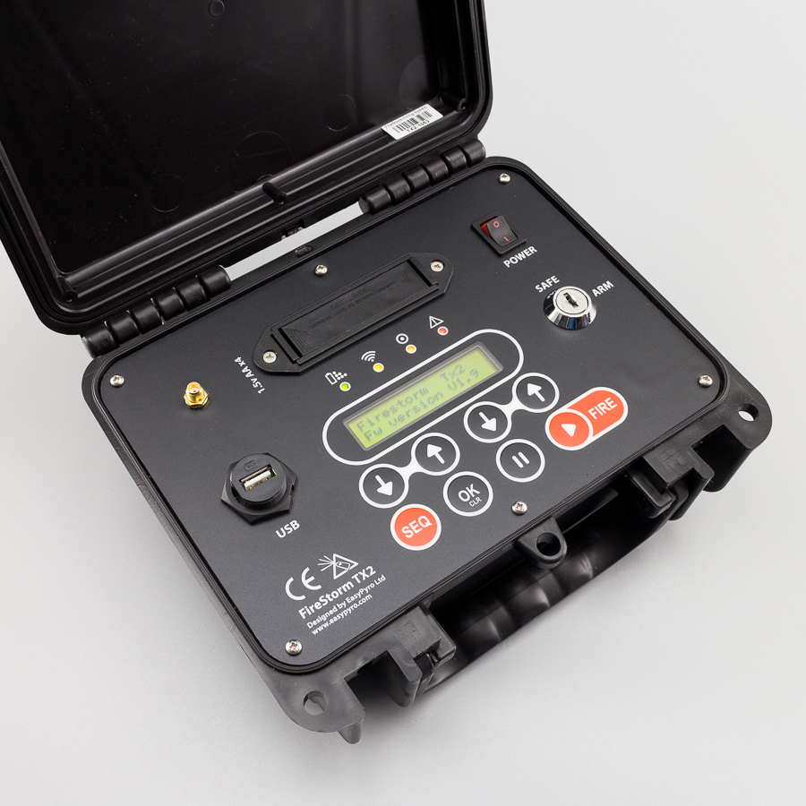

# FireStorm Firing System User Guide

## Introduction

Thank you for purchasing a FireStorm Firing System.

This firing system is designed for the safe and reliable wireless control of fireworks and pyrotechnics.

## Power & Batteries

  <strong>Warning:</strong> Do not use zinc-chloride batteries. They are often branded "Heavy Duty". These can not supply enough current. Only use disposable Alkaline or Lithium batteries.

We recommend Energizer Industrial alkaline batteries. 

You can also use disposable Lithium batteries. 

Lithium batteries have some advantages over Alkaline batteries.
* High current capability.
* Low temperature performance.
* Higher overall capacity.
* No leaking.
* Low self discharge.

However there are some disadvantages.
* Significantly higher cost.
* Unreliable battery level indication - the battery level readout on the firing modules is set for Alkaline batteries. 

|Device|Batteries Required|External Power Connector?|Firing Voltage|
|------|------------------|-------------------------|--------------|
|TX1 Handheld Remote|2 x AA|No|--|
|TX2 Control Desk Remote|4 x AA|Optional|--|
|RX1|1 x PP3 9V|No|9V|
|RX6|2 x PP3 9V|Optional|18V|
|RX18|2 x PP3 9V|Yes|18V internal, 12/24V external|
|RX36|2 x PP3 9V|Yes|18V internal, 12/24V external|

### RX1 Battery Install

1. Remote 2 x screws marked with a silver dot using **Philips PH1** screwdriver.
2. Remove end panel.
3. Slide battery in first and attach battery clip securely. Note the correct orientation of the battery for the clip to attach.
4. Reassemble.

<strong>Tip:</strong> Counter rotate screws until you hear a "click", then hand tighten. This will prevent the threads from being stripped in the enclosure after repeated use.

### RX6 Battery Install

- Remote 4 x screws on terminal end marked with a silver dot using **Philips PH1** screwdriver.
- Remove 2 x screws on antenna end marked with silver dot.
- Remove terminal end panel and plastic bezel.
- Slide lid away from you.

<strong>Tip:</strong> The lid can be stiff. Grip module in both hands, place thumbs on lid, and push away from you firmly. A slight opening / bending pressure on the module can open the "C" shape of the module and let the lid slide easily.

- Lever battery in at and angle and push down. Squeeze battery onto contacts. Ensure battery is properly engaged with contacts. 

<strong>Warning:</strong> To remove batteries lever them <strong>up and out</strong> as shown. If you push them away from the contacts,, the battery can release suddenly and potentially damage components behind it. 

- Reassemble.

<strong>Tip:</strong> Counter rotate screws until you hear a "click", then hand tighten. This will prevent the threads from being stripped in the enclosure after repeated use.

## Initial Setup

The system is designed so that a firing module is **bonded** to a remote control. The cue that the remote control is set to when you bond the module is the **starting cue** for that module.

**Example:** An 6 cue module is bonded to a remote control set to Cue [01]. Cue [01] [02] [03] [04] [05] [06] on the remote control will now fire terminal 1,2,3,4,5,6 on the firing module. 

**Example:** An 18 cue module is bonded to a remote control set to Cue [10]. Cue [10] → [28] on the remote control will now fire terminal 1 → 18 on the firing module. 

**More examples below:**

|Module Type|Starting cue (what the remote shows) ...|Module will fire on ...|
|-----------|------------|---------------------------------------|
|RX6 (6 cue module)|[01]|[01] → [06]|
|RX6 (6 cue module)|[07]|[07] → [12]|
|RX36 (36 cue module)|[01]|[01] → [36]|
|RX36 (36 cue module)|[37]|[37] → [54]|

### Bonding

The system requires you to initially **bond** a firing module to the remote control.

This prevents unauthorised firing except from the desired remote control.

You do not have to do this more than once, unless you wish to reconfigure the system. 

The TX1 handheld remote control and the TX2 control desk both allow bonding of firing modules in very similar ways.

During the bonding process the Channel Number and Cue Number that the firing module will respond to is set.

First we must explain the difference between **Channel Number** and **Cue Number**.

### Channel Number

This is the channel that the remote control is operating on. Consider different channels to be like having completely separate remote controls. Anything bonded to Channel 1 will not be controller when the remote is set to Channel 2 etc.

Channels are useful for dividing your show when using multiple firing modules. For example, you may have three firing modules at the front of your show set to Channel 1, and two more firing modules at the back of your show set to Channel 2.

### Cue Number

A cue is the identifying number of a terminal on the firing module. For example the RX6 firing module has 6 cues to connect igniters. The RX36 has 36 cues to connect igniters. 

## Bonding Introduction

When you bond a firing module to a remote control, the firing module will respond to the Channel and Cue that you set when bonding.

For example, if the remote control is set to Channel 1 and Cue 1 and you bond it to an RX36 firing module, the firing module will fire when Channel 1 is set and Cue 1 to 36 is fired on the remote control.

If you then set the remote control to Channel 2 and Cue 01, and bond the firing module again, it will now fire when Channel 2 is set and Cue 1 through 36 is fired on the remote control.

Finally if the remote control is set to say Channel 1 and Cue 10, and you bond the firing module, it will now fire when Channel 1 is set and Cue 10 through 45.

You can bond the firing modules as many times as you like to reconfigure your firing system for different shows and setups. This easy bonding procedure is one of the powerful features of the FireStorm Firing System.

  <strong>Warning:</strong> When bonding your modules to a remote control, only bond 1 module at a time. Do not attempt to bond multiple modules at the same time. Bond the modules 1 by 1.

## Bonding Procedure

### 1. Place firing module in Bonding Mode

- Connect antenna to module.
- Arm the module by setting slide switch (RX1 or RX6) or key switch (RX18 or RX36) to ARM. Allow a few seconds for the module to start up.
- Press and **hold** the bond button for about **5 seconds** until the bond LED is solid Orange 🟠.
(🟠 = The module is now in bonding mode and ready to be linked to a remote control.)

  <strong>Note:</strong> Do not hold the bond button for until the bond LED switches off (~15 seconds). This will reset the module.

### 2. Set Channel and Cue on Remote Control

#### TX1 Handheld Remote

- Connect antenna.
- Switch remote on by holding power button for about 1s.
- Ensure remote is disarmed (top right LED should be off). Display should be showing the currently selected Cue between [01] and [99].

  <strong>Warning:</strong> Remote must be disarmed for bonding! Module will not bond when remote is armed. 

- Press and release power button to enter **channel set mode**. Many users will never have to do this, and will leave the remote always on Channel 1. Display will show [c1], [c2] → [c9].Select desired channel with arrow buttons. In general, you will leave this set to [c1].
- Tap POWER button again to exit **channel set mode**. Display will return to the currently selected cue [01] →[99].
- Set desired starting cue for the module. If you only have 1 module, generally leave this set to [01].
- Press and release the fire button.
- Module bond LED will extinguish and return to flashing the battery level every 5 seconds. 
- The middle light on the remote will now be either RED or GREEN to show the continuity status of the currently selected cue. If an igniter is connected, it will be GREEN. If there is no igniter, it will be RED.

  <strong>Note:</strong> The remote link LED is updated 1 x per second to show the continuity status of the selected cue. 

|Link LED|Status|
|---------|------|
|⚪ Off   |No signal|
|🟢 Green |Good Continuity, igniter connected|
|🔴 Red   |Bad continuity, no igniter connected|

#### TX2 Control Desk Remote

